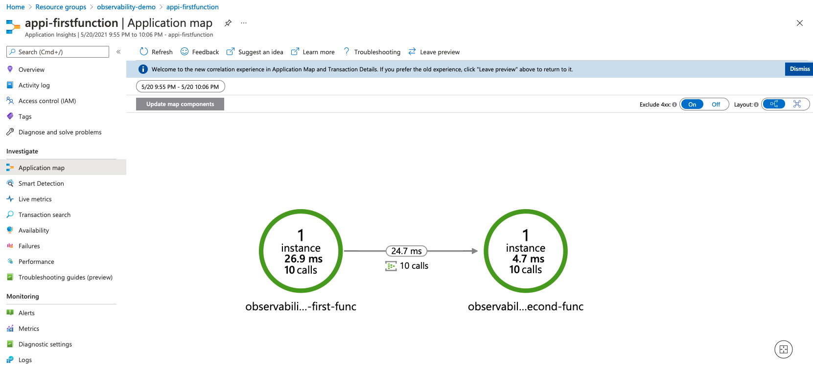

# About this repo
This repo contains 2 simple C# event-triggered Azure functions to help you try out the monitoring visualizations explained in this dev blog:

https://devblogs.microsoft.com/cse/2021/05/13/observability-for-event-stream-processing-with-azure-functions-event-hubs-and-application-insights/

# Steps
1. Create 2 Azure Event Hubs
2. Create 2 Azure Application Insights (or created automatically when creating azure functions)
3. Setup the local.settings.json. Please refer to local.settings.sample.json.
4. Deploy the functions to Azure if you want to run on cloud. This sample will also work locally.
5. Send events to Azure Event Hubs using the [IoT Telemetry Simulator](https://github.com/Azure-Samples/Iot-Telemetry-Simulator
):
    ```
    docker run -it -e "EventHubConnectionString=<your_connection_string>" -e DeviceCount=1 iottelemetrysimulator/azureiot-telemetrysimulator
    ```
6. Go to App Insights and you should be able to see some visualizations such as Application Map:
    
